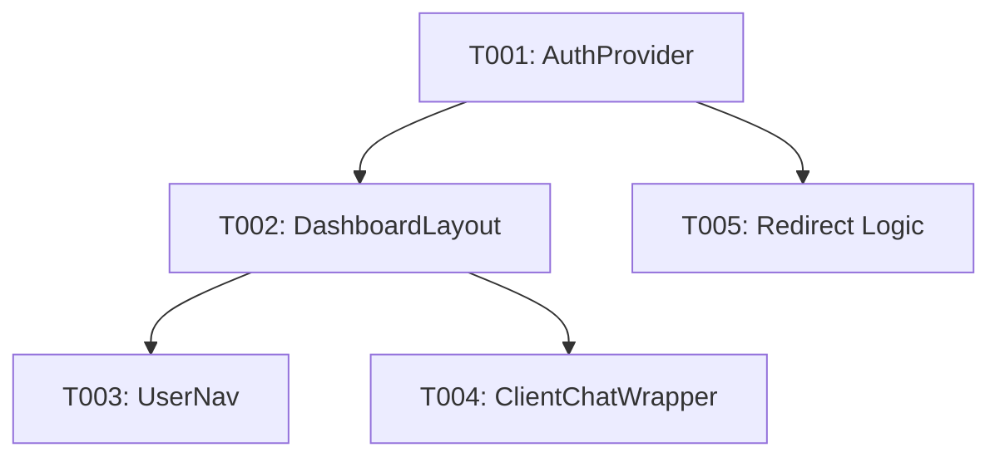

# Tasks: Cross-Domain Client-Side Authentication Fix

**Feature Branch**: `041-client-side-auth`
**Implementation Strategy**: MVP first. Implement the global `AuthProvider` and refactor the dashboard layout to use client-side session validation to resolve the redirect loop.

## Dependency Graph

## Phase 1: Setup

- [x] T001 [P] Create the authentication context and provider in `frontend/context/auth-context.tsx`

## Phase 2: Foundational

- [x] T002 [P] Refactor the dashboard layout in `frontend/app/dashboard/layout.tsx` to use the `AuthProvider`

## Phase 3: User Story 1 - Accessing Protected Dashboard (Priority: P1)
**Goal**: Ensure users can access the dashboard without being redirected to sign-in after a successful login.

- [x] T003 [P] [US1] Refactor `UserNav` in `frontend/components/dashboard/user-nav.tsx` to consume user data from `AuthContext`
- [x] T004 [P] [US1] Refactor `ClientChatWrapper` in `frontend/components/dashboard/client-chat-wrapper.tsx` to consume `userId` from `AuthContext`

**Independent Test Criteria**:
- Sign in successfully.
- Access `/dashboard`.
- Verify no redirect loop occurs.
- Verify user email/name displays correctly in the navigation.

## Phase 4: User Story 2 - Seamless Client-Side Session Validation (Priority: P1)
**Goal**: Background validation of session using client-side fetch with credentials.

- [x] T005 [US2] Implement and verify `credentials: "include"` in the `checkAuth` fetch call within `frontend/context/auth-context.tsx`

**Independent Test Criteria**:
- Inspect network logs for `/api/auth/get-session`.
- Verify `Cookie` header is sent in the request.
- Verify loading spinner is visible during the request.

## Phase 5: User Story 3 - Protection of Secure Routes (Priority: P2)
**Goal**: Redirect unauthenticated users or expired sessions to the sign-in page.

- [x] T006 [US3] Verify redirect logic in `AuthProvider` for 401/403 responses and network failures

**Independent Test Criteria**:
- Clear cookies/session.
- Attempt to access `/dashboard`.
- Verify automatic redirection to `/sign-in`.

## Phase 6: Polish & Verification

- [x] T007 Verify centralized "Authenticating..." loading screen prevents content flashing (FOUC)
- [x] T008 Perform final manual verification of chatbot task persistence linked to the correct user ID
- [x] T009 Run syntax checks and verify imports in all modified files per Verification Protocol
